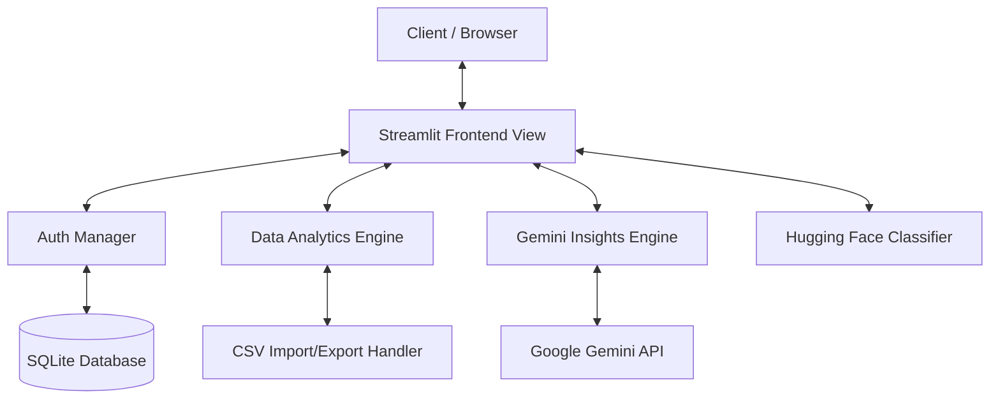

# 💰 AI Personal Finance Tracker

[](https://www.python.org/)
[](https://streamlit.io/)
[](https://www.sqlite.org/)
[](https://huggingface.co/)
[](https://ai.google.dev/)

An intelligent, AI-powered personal finance manager that automates expense tracking, categorizes transactions using Natural Language Processing (NLP), and provides tailored financial recommendations using the Google Gemini LLM.

Designed with a premium glassmorphic interface, this application offers users a seamless way to audit budgets, visualize spending trends, monitor savings milestones, and converse with a virtual financial assistant.

---

## 📌 Project Overview

Managing personal finances is often tedious and prone to manual input errors. The **AI Personal Finance Tracker** solves this by leveraging modern machine learning and large language models:
* **Automated Categorization**: Uses NLP to classify transaction descriptions (e.g., "Uber" $\rightarrow$ "Travel") without manual tagging.
* **LLM Insights**: Analyzes user ledger sheets via the Google Gemini API to pinpoint spending leaks, suggest budget corrections, and outline optimization pathways.
* **Interactive Diagnostics**: Features a conversational AI chatbot that reads transaction history to answer specific personal finance queries.

---

## ✨ Features

- **🔐 User Authentication**: Secure login and sign-up flows using PBKDF2 password-hashing functions and SQLite user registries.
- **🏷️ AI Transaction Categorization**: Real-time transaction categorization using Hugging Face NLP transformers to normalize inputs.
- **📊 Expense Analytics**: High-performance visualization charts for category distributions, monthly balances, and expense ratios.
- **📉 Budget Tracking**: Set customized monthly budget caps with dynamic budget notifications and indicator warnings.
- **📅 Monthly Expense Trends**: Period-over-period tracking showing long-term spending patterns.
- **💡 AI Financial Insights**: Auto-generated spending evaluations highlighting high-expenditure categories, saving rates, and customized cashflow tips.
- **🎯 Goals Tracking**: Savings goal manager with dynamic progress bars to monitor milestones.
- **📥 Download Reports**: One-click data export to standard CSV formats for spreadsheet compatibility.

---

## 📸 Screenshots

### 1. User Authentication


### 2. Live Portfolio Dashboard


### 3. Expense Analytics


### 4. Gemini AI Insights & Chat


### 5. Budget Goals Tracking


---

## 🏗️ Project Architecture



### Technical Design Breakdown:
1. **Frontend Presentation**: Custom CSS styling wrapped in Streamlit rendering grids to offer dark-mode glassmorphic layouts.
2. **Database Engine**: Relational SQLite architecture configured with indexed schemas (`idx_transactions_user_id`, `idx_goals_user_id`) to execute rapid user-specific data reads.
3. **NLP Classification Classifier**: Custom script integrating pre-trained transformers to recognize text patterns and assign labels.
4. **LLM Integration**: Direct API connections streaming transaction records contextually to Google's Gemini models for structured financial advisory responses.

---

## ⚙️ Installation

### 1. Clone the Repository
```bash
git clone https://github.com/Vanisha-Gowda01/AI-Personal-Finance-Tracker-1-.git
cd AI-Personal-Finance-Tracker-1-
```

### 2. Set Up a Virtual Environment
```bash
python -m venv venv
source venv/bin/activate  # On macOS/Linux
venv\Scripts\activate     # On Windows
```

### 3. Install Dependencies
```bash
pip install -r requirements.txt
```

### 4. Configure Environment Variables
Create a `.env` file in the root directory:
```env
GEMINI_API_KEY=your_google_gemini_api_key_here
```

---

## 🚀 Usage

### Run the Application
Start the Streamlit application server:
```bash
streamlit run app.py
```
*The app will automatically open in your default browser at `http://localhost:8501`.*

---

## 🔮 Future Enhancements

- **Direct Bank Integration**: Implement Plaid API integrations to fetch live financial transactions securely.
- **Predictive Forecasting**: Apply time-series models (e.g., ARIMA or Prophet) to forecast future balances and warn users of prospective budget overruns.
- **Receipt Parsing**: Add OCR components (like Tesseract or Google Cloud Vision) to parse uploaded receipts and log line items.
- **Multi-currency Support**: Real-time currency conversions for international expense tracking.

---

## 👩‍💻 Author

**Vanisha**
* Github: [@Vanisha-Gowda01](https://github.com/Vanisha-Gowda01)

---
*Created as part of an AI-powered personal finance intelligence portfolio.*
